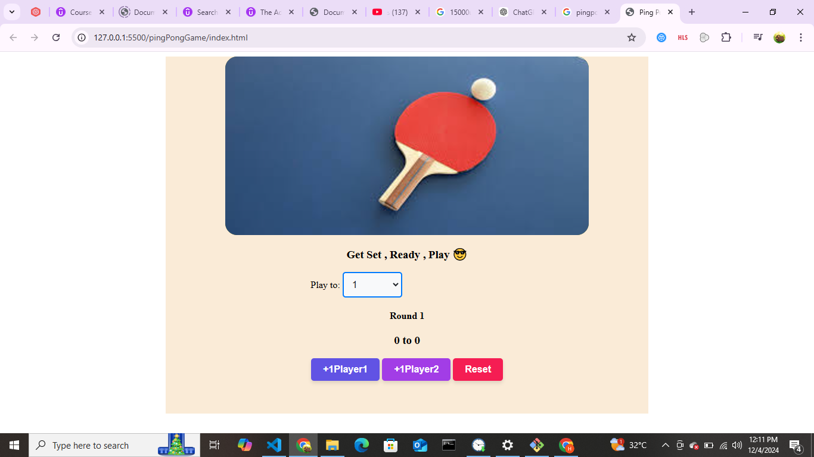

Ping Pong Game
A simple, interactive Ping Pong score-keeping game built using HTML, CSS, and JavaScript. This project allows two players to compete in a fun match while keeping track of scores and rounds. Players can set the match length and play until a winner is determined!

Features
Dynamic Score Tracking: Updates scores for Player 1 and Player 2 in real-time.
Custom Match Length: Users can choose the maximum score to play up to.
Round Progression: Displays the current round as players advance.
Winning Logic: Declares a winner (or a tie) when the game ends.
Reset Functionality: Resets the game to play again without refreshing the page.
Interactive UI: Styled buttons and dropdowns for a seamless user experience.
Demo
How to Play:
Select the target score from the dropdown menu.
Press +1 Player 1 or +1 Player 2 to increment scores.
The game automatically ends when the target score is reached, declaring a winner.
Use the Reset button to start a new game.
Technologies Used
HTML: Structure of the webpage.
CSS: Styling and layout of the game interface.
JavaScript: Core functionality, including score tracking and game logic.
Installation and Usage
Clone this repository:
bash
Copy code
git clone https://github.com/zakyboss/ping-pong-game.git
Navigate to the project folder:
bash
Copy code
cd ping-pong-game
Open the index.html file in any modern web browser:
bash
Copy code
open index.html
Project Screenshot

What I Learned
Creating and updating dynamic UI elements using JavaScript.
Using event listeners to handle user interactions.
Basic DOM manipulation to track and display game progress.
Styling interactive components with CSS for a polished look.
Future Improvements
Add sound effects for button clicks and victory announcements.
Implement player name input fields for personalization.
Include an animated scoreboard or visual effects for enhanced gameplay.
Make the game responsive for mobile devices.
Contributing
Contributions are welcome! Feel free to fork the repository and submit a pull request with your improvements.

Acknowledgments
Inspired by the idea of creating small interactive web-based games to enhance my JavaScript and frontend development skills.

Contact
For any questions or feedback, please reach out:

Email: boochimo8@gmail.com
GitHub: zakyboss
